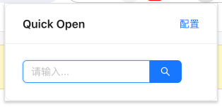
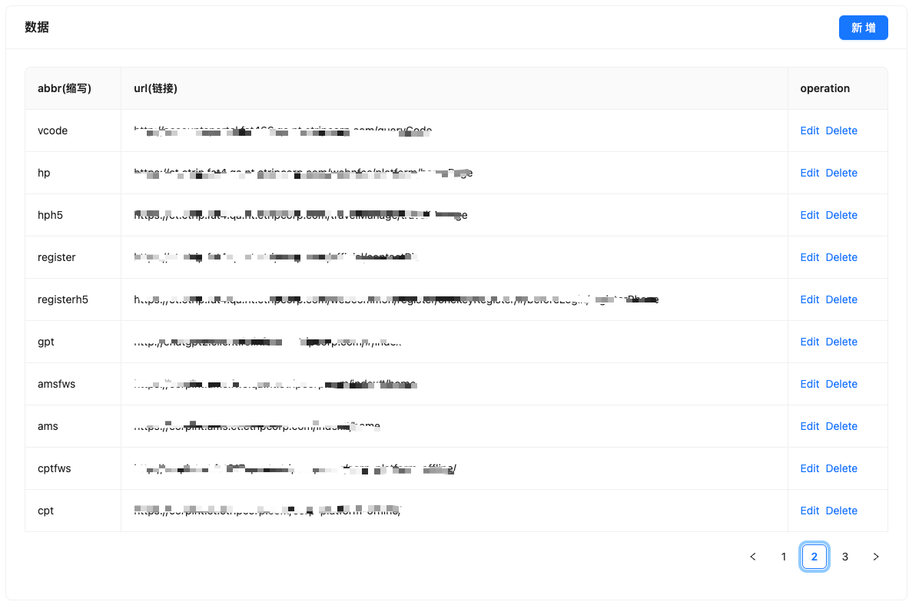
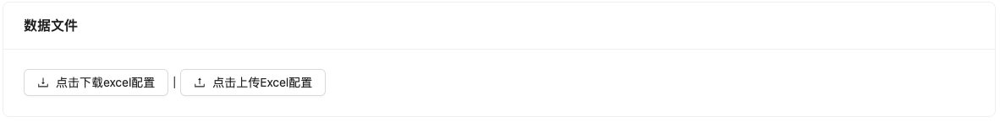

# Chrome Extension QuickOpen

一个快速打开指定标签页的谷歌插件

## 说明
1. 快捷打开标签页：通过输入的简写打开新标签页。比如，输入 `git`，打开 `Github` 官网。
2. 配置文映射表：可以配置简写和`url`的映射关系，数据存储在 `Chrome` 的本地和个人账户。

## 功能演示

### 快速打开标签页

步骤1：输入快捷键`Command + E`或者`Ctrl + E`打开插件

步骤2：输入简写按下回车快速打开指定标签页

### 配置映射表
方式一：点击【配置】按钮，跳转到配置页面，可以对映射表进行增删改查。

方式二：通过excel进行批量下载和上传
